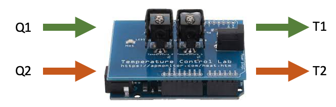
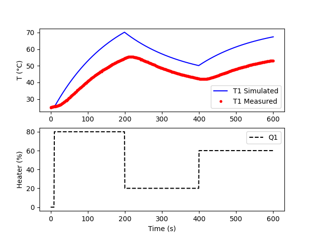
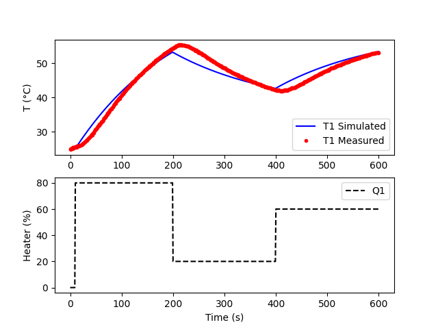
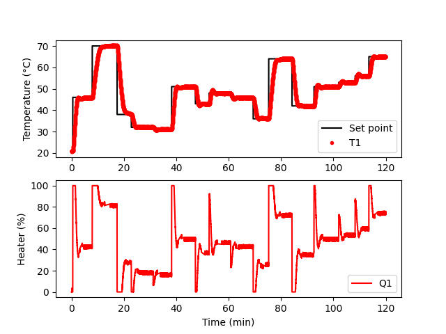
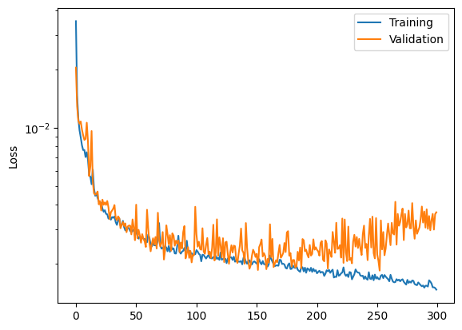
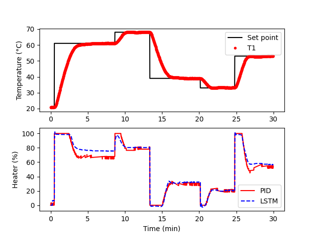
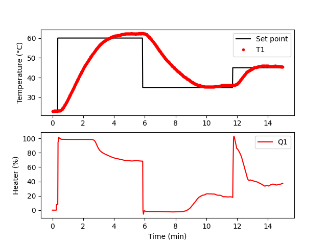

# ChEn 436 Final Project

This repository contains the code for the final project in ChEn 436 (Process Control) at Brigham Young University (BYU). The purpose of this project was to develop and evaluate a machine learning controller for a [Temperature Control Lab (TCLab)](http://apmonitor.com/pdc/index.php/Main/ArduinoTemperatureControl). We used a Long Short-Term Memory (LSTM) model for our controller.

Project contributors (GitHub usernames in parantheses):
- Chris Hasleton (ch662)
- Zack DeGraw (zdegraw)
- Adam Bates (abates20)

The full project workflow can be run using the jupyter notebook [project_workflow.ipynb](project_workflow.ipynb). Alternatively, a separate python script is provided for each section of the project. The code for the main classes (`PID`, `PhysicsModel`, `LSTMController`, etc.) used in the project are stored in the folder [project](project/) which is set up as a simple python package.

## Project Outline

- Explore the dynamics of the TCLab
- Implement and train an LSTM model using a proportional-integral-derivative (PID) controller
- Test the controller performance of the LSTM model

# TCLab Dynamics

The TCLab is a small arduino with two heaters and two temperature sensors. A computer provides a value (0-100%) for each heater (Q1 and Q2) and can then record the resulting temperature response (T1 and T2).

Before attempting to control the temperature of the TCLab, we first explored its dynamics. The temperature of each heater can be modeled using an energy balance (shown below) with one-dimensional heat transfer. We did not attempt to model the full complexity of the system (e.g., heat transfer between heaters), but instead derived a simpler physics-based model as a reasonable approximation. In deriving our model, we assumed there is no internal temperature variation and the heat capacity and transfer coefficients remain constant.

$$m c_p \frac{dT}{dt} = UA (T_a - T) + \epsilon \sigma A (T_a^4 - T^4) + \alpha Q$$

To improve the accuracy of our model, we measured the response of T1 to a series of step changes in Q1 and then fit multiple parameters ($mc_p$, $U$, $A$, and $\epsilon$) to the data. The following figures show first the model with initial guess values and then the model with fitted parameters.

This section of the project can be run in the jupyter notebook [project_workflow.ipynb](project_workflow.ipynb) or with the python script [tclab_dynamics.py](tclab_dynamics.py).

# LSTM Training
LSTM is a type of recurrent neural network (RNN) where input data is transformed through a series of layers in the model to produce an output. This type of model works well for time-series data (data points across time), like measured T1 values from the TCLab over a certain amount of time. A key feature of the LSTM model is its ability to “remember” previous data to aid future predictions. The basic idea of applying this model to the TCLab is that you can give it a short window (e.g., 15 seconds) of setpoint and error (the difference between T1 and the setpoint) data, and it will predict the next Q1 value.

A large amount of data is required to train ML models. To generate training data, we developed a Proportional-Integral-Derivative (PID) controller to supply values for Q1 across a series of setpoint steps for T1. Data was generated for a 2-hour period and is shown the next figure. 

We then used this simulated data to train the LSTM model. The training and validation losses (training data was split 80/20 for training and validation) are shown in the next figure.

This section of the project can be run in the jupyter notebook [project_workflow.ipynb](project_workflow.ipynb) or with the python script [train_lstm.py](train_lstm.py).

# LSTM Testing

After training the model, we generated a new set of data with the PID controller and tested the LSTM model against it (results shown in next figure). During the first setpoint step, the LSTM model consistently predicted Q1 values above those of the PID controller, but for later steps, the LSTM and PID values were very close to each other. Assuming this pattern continues in further tests, we expect that the LSTM controller would overshoot the first temperature setpoint, but not later setpoints.

After this initial validation, we then used the LSTM model to control T1 on the physical TCLab. As expected, T1 noticeably overshot the setpoint for the first step, but not for later steps.

This section of the project can be run in the jupyter notebook [project_workflow.ipynb](project_workflow.ipynb) or with the python script [test_lstm.py](test_lstm.py).